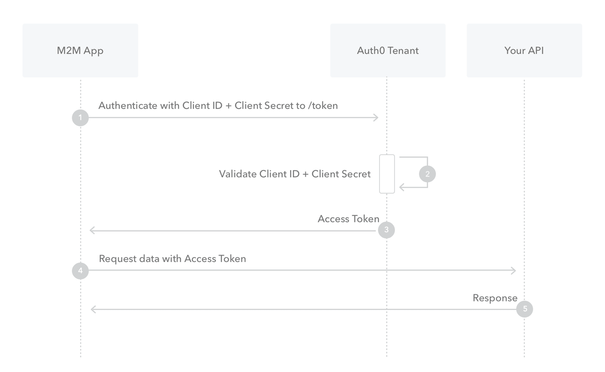

# entity-api-guide

- [entity-api-guide](#entity-api-guide)
  - [Intro](#intro)
  - [Roadmap](#roadmap)
    - [Business Objects](#business-objects)
  - [OData Specification](#odata-specification)
    - [Supported Access Schemas](#supported-access-schemas)
    - [Supported Queryparameters](#supported-queryparameters)
  - [Authentication](#authentication)
    - [Auth Endpoint Configuration URL](#auth-endpoint-configuration-url)
    - [Client Credential Grant](#client-credential-grant)
    - [Authorization Flow](#authorization-flow)
    - [Authorization Scope](#authorization-scope)
  - [Pagination](#pagination)
  - [Querying Entities](#querying-entities)
    - [Available Testing VM](#available-testing-vm)
    - [Postman Collection](#postman-collection)
  - [Work in Progress](#work-in-progress)
  - [Limitations](#limitations)
- [Tools](#tools)
  - [Open API](#open-api)

## Intro
This guide shall be used to help provide a client side implementation for usage of the new Abacus Entity API.

Entity API is a new Interface for processing and returning REST Request/Response Pairs as per OData 4.0 Specification.

It is intended to be the new way to communicate with the Abacus Business Software.

Essentially this quickstart provides the reader with information about how to wrap his webrequests to communicate with the API as intended.

**For this quick start guide we will be using the Subjects Entity defined for the CRM subsystem of the Abacus application.**

Also we have attached the roadmap of Business Units which are planed to be translated into entities until the official release of the Entity API in Feb. 23'.

## Roadmap

Abacus supports a wide array of [product modules](https://www.abacus.ch/produkte). For most of these products, APIs for the individual business objects are being develped and incrementally released from the version 2023 on.

### Business Objects

Here is a table which shows which entities are planned to be developed.

| Product | Business Objects |
|---------|------------------|
| Allgemein | Geschäftsbereiche, Unternehmen, Währungen, Wechselkurse, MWST-Codes, Dossiers |
| CRM | Subjekte, Anschriften, Verbindungen, Kommunikationsdaten, Gruppierungen und -Einträge |
| Finanzbuchhaltung | Buchungen, Konten, Kostenstellen |
| Kreditoren | Belege, Lieferanten |
| Debitoren | Belege, Kunden, Zahlungen |
| Projektverwaltung | Buchungen, In & Out |
| Servicemanagement | Serviceaufträge |
| AbaBau | LV Übernahme |
| Auftragsbearbeitung | Produktstamm, Preisfindung, Verkauf, Einkauf |
| AbaImmo | Mieter, Eigentümer, Immobilien, Objektverträge |
| Lohn | Personalstamm, Vorerfassung, Lohnabrechnung |
| Human Resources | Bewerberstamm |


**If you have questions or inputs to this roadmap we will of course respect our customers wishes! Feel free to contact us if you would like us to implement the entity for your use case earlier.**


## OData Specification

The [OData 4.0 Specification](https://docs.oasis-open.org/odata/odata/v4.01/odata-v4.01-part1-protocol.html) provides its users with a multitude of possible queryparameters and resulting manipulations of response datasets.

### Supported Access Schemas

Mainly data querying is done through the Entity API at the moment. Usually this is done through a GET request to the server with a URL corresponding to the following Schema:

- Access of available infromation about queryable entity endpoints e.g. /
- Access metadata about underlying defined entities e.g. /$metadata 
- Access of Entity e.g. /Subjects
- Access of specific Entity via primary key e.g. /Subjects(2)
- Access of specific Entity property via key & property e.g. /Subjects(2)/LastName

### Supported Queryparameters 

Further there are system operations defined for certain queryparameters if supplied in the request:

| Queryparameter | Usage Explaination | Example |
|----------------|--------------------|---------|
| filter | Used to filter response set by a property. Implements logical operators: eq, lt, gt, le, ge | $filter=LastName eq 'Strasser' |
| select | Used to query only certain properties of entity. If the primary key is not selected an odata.id is inserted to uniquely identify the items of the returned set. | $select=LastName,AddressNumber |
| top | Used to select only the top number of elements returned by query. | $top=10 |
| orderby | Used to order the returned query by a certain attribute in asc or desc order | $orderby=LastName desc |
| expand | Used to expand a navigation property into the returning query | $expand=Addresses |
| format | Used to change the format of the webservers response. supported formats are json, atom & xml | $format=json |

## Authentication

To access the Entity API and thus the data stored inside the Abacus installation an authentication method is required.

Authentication is done via [OAuth 2.0](https://oauth.net/2/).

The client receives a bearer token through the authentication endpoint by use of an OAuth Flow. This token is then set in the authorization header of the webrequest.

### Auth Endpoint Configuration URL

At the moment the authentication is done through the **/oauth/oauth2/v1/token endpoint**.
Clients can request the URL of the token issueing endpoint via OpenID Connect via the /.well-known/openid-configuration endpoint of the responsible domain

### Client Credential Grant

To use this OAuth Flow an Abacus Service User is required. This service users has a clientID and client_secret which need to be supplied.

There can also be a supplied [Authentication Scope](#authentication-scope) to limit the applications access to the Abacus Installation. Currently scoping is done at creation of the service user

Then the user sends a POST request to the OAuth endpoint with the following body:

```json
grant_type: "client_credentials"
client_id: "<client_id>"
client_secret: "<client_secret>"
```

If the client credentials are valid an access_token is received.


[Source: auth0.com](https://auth0.com/docs/get-started/authentication-and-authorization-flow/client-credentials-flow)

### Authorization Flow

In this OAuth Flow the user receives a popup with the requested [Authentication Scope](#authentication-scope). If the user agrees, is logged in and has the required permissions the access_token is granted.

*The Authorization Flow is currently WIP*

### Authorization Scope

The scope parameter of the token grant request is used to limit the access of either an user or an application receiving the grant.

## Pagination

The Entity API uses server driven paging according to the Odata 4.0 specification making use of the $skiptoken queryparameter for the nextlink field of the webserver response.

The $skiptoken is used to tell the client how much of the returned dataset he has received. If there is no nextlink field in the response of the Entity API server the client has reached the end of the queried dataset.  

## Querying Entities

At the moment we are in the process of migrating the various subsystems to the new Entity API Model. Subsequently only a portion of possible Entities is available at this moment.

Access is achieved via the following basic Url: **https://<your_domain>/api/entity/<used_version>/mandants/<mandant_number>/<used_entity>**

<small>*NOTE: <your_domain>, <used_version> most likey v1, <mandant_number> most likely 7777, <used_entity> for this guide Subjects*</small>

### Available Testing VM

There is a live testing VM which can be used. At the moment you need to contact Abacus and we will configure a service user for you. With the id and secret of the service user you can query as you like for example with the [Postman Collection](#postman-collection).

VM Url: **https://entity-api1-1.demo.abacus.ch**

### Postman Collection

There is a Postman Collection of possible requests attached in this repository.

To use this Postman Collection the follow Collection Variables need to be set:

- BASE_URL=Your Domain
- CLIENT_ID=Your Service User ID
- CLIENT_SECRET=Your Service User Secret

*NOTE: Remember you need an active access_token to successfully query the API*

## Work in Progress

Most of the work for the read queries is done and bug reports or feature requests are appreciated.

Odata specifications further defines several ways of giving commands or invoking functions of a service through PUT, DELETE & POST Request. Theses are currently a work in progress.

## Limitations

There are some operations which work very well with our underlying database structure and query very efficiently using the existing indexes consequently there are some operations defined in the specification which do not work efficiently with our implementation and are thus unsupported.

These are:
- count
- skip (see [Pagination](#pagination))
- orderby: we support ordering on columns which do have a physical index on the database to provide fast responses
- filter: the same limitation applies to filters

In case you combine orderby and filter queries, both columns need to match. For example while filtering the subjects on the last name (/Subjects?$filter=LastName eq 'Baumann') you may not order it by its Id.

# Tools

We would also like to give an overlook of supporting tools which can be used to interact and develop for the new Abacus API.

## Open API

It is possible to generate an Open API specification file from the services metadata XML file.

To generate the specification use a converter. Here you have a variety of options. It is recommended to use the offical tool provided by the [OData Technical Committee](https://www.oasis-open.org/committees/tc_home.php?wg_abbrev=odata) on their [Github](https://github.com/oasis-tcs/odata-openapi)

To get the required CSDL Schema send a GET Request to ```{{ServiceRoot}}/$metadata``` and save the result in a XML file.

